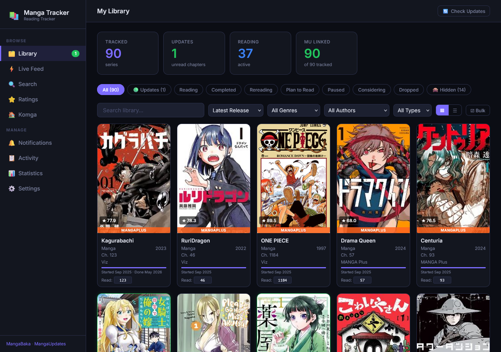
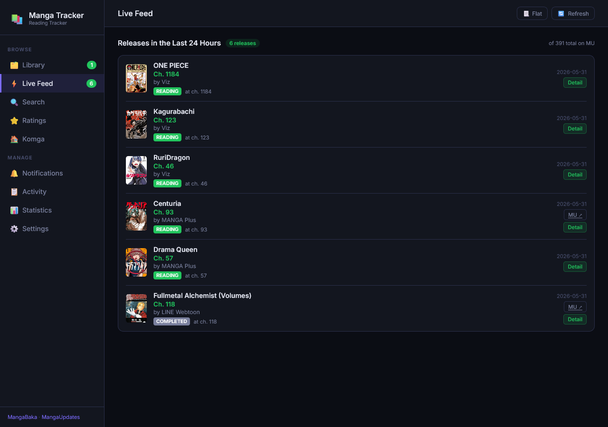
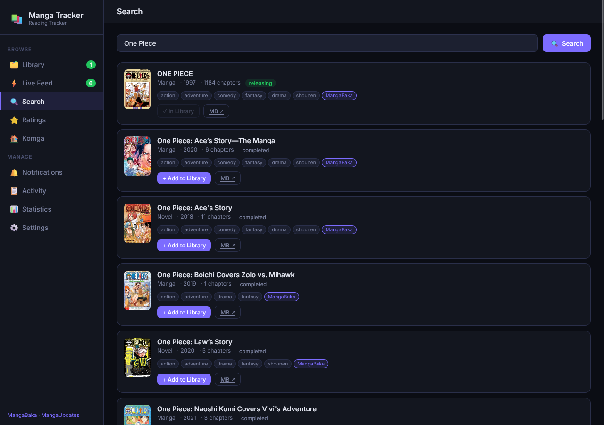
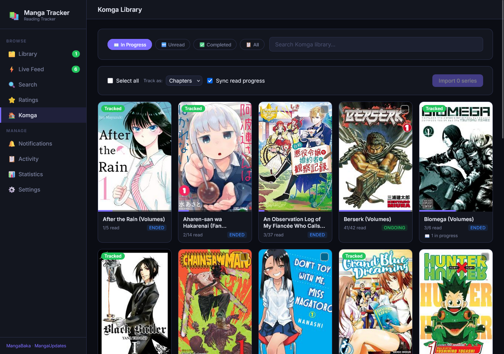
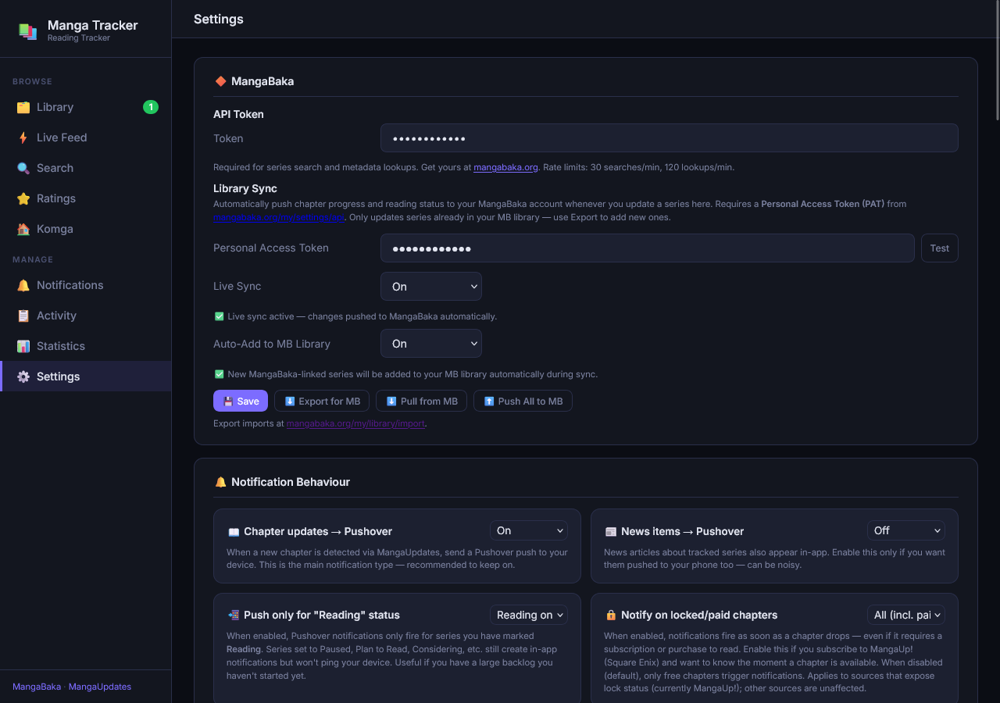

# Manga Tracker

Self-hosted manga release tracker. Monitors multiple sources for new chapters and delivers push notifications via [Pushover](https://pushover.net).

> **Personal project.** Built for my own use. Support is best-effort at most — issues and PRs are welcome, but response time and fixes are not guaranteed.

---

## Features

- Track manga across KManga, MangaDex, MangaPlus, MangaUpdates, and MangaUp
- Background polling on a configurable interval
- Push notifications via [Pushover](https://pushover.net)
- Optional [Komga](https://komga.org) library integration — sync read progress and detect unread releases against your local library
- Web UI for managing series and viewing release history
- Docker image with Unraid community app support

---

## Screenshots

| Library | Live Feed |
|---|---|
|  |  |

| Search | Komga | Settings |
|---|---|---|
|  |  |  |

---

## Prerequisites

- A [MangaBaka](https://mangabaka.org) account and personal API token — this is the metadata backbone the app relies on
- Docker (recommended) or Python 3.11+
- A [Pushover](https://pushover.net) account if you want push notifications (optional)

---

## Quick Start

```bash
cp .env.example .env
# Edit .env — set MANGABAKA_TOKEN at minimum
docker compose up -d
```

App runs at `http://localhost:8765`.

Pushover credentials can be entered in the Settings UI after first launch instead of in `.env`.

---

## Configuration

All configuration is via environment variables. See [`.env.example`](.env.example) for the full reference.

| Variable | Required | Default | Description |
|---|---|---|---|
| `MANGABAKA_TOKEN` | **Yes** | — | MangaBaka personal API token |
| `POLL_INTERVAL_HOURS` | No | `6` | How often to check for new chapters |
| `DB_PATH` | No | `/data/manga_tracker.db` | SQLite database path (inside container) |
| `PUSHOVER_USER_KEY` | No | — | Pushover user key |
| `PUSHOVER_APP_TOKEN` | No | — | Pushover app token |

---

## Docker Compose

Minimal production setup:

```yaml
services:
  manga-tracker:
    image: ghcr.io/gregoryn22/manga-tracker:latest
    restart: unless-stopped
    ports:
      - "8765:8000"
    volumes:
      - ./data:/data
    environment:
      - MANGABAKA_TOKEN=your_token_here
      - PUSHOVER_USER_KEY=
      - PUSHOVER_APP_TOKEN=
      - POLL_INTERVAL_HOURS=6
```

Data persists in `./data/manga_tracker.db`. Back this up if you care about your tracked series.

---

## Komga Integration

If you run a [Komga](https://komga.org) media server, Manga Tracker can compare your tracked series against your local library to surface unread volumes and sync read progress.

To connect:

1. Generate an API key in Komga → **User Settings → API Keys**
2. Enter your Komga URL and API key in Manga Tracker's **Settings** page
3. On any tracked series, paste the Komga series ID (visible in the series URL: `.../series/<ID>`)

---

## Development

```bash
pip install -r requirements.txt
cp .env.example .env
# Fill in MANGABAKA_TOKEN
uvicorn app.main:app --reload
```

App runs at `http://localhost:8000` in dev mode.

---

## Support

This is a personal project maintained in spare time. If something is broken, open an issue — no guarantees on when or whether it gets fixed. Feature requests are unlikely to be acted on unless they overlap with something I want anyway.
